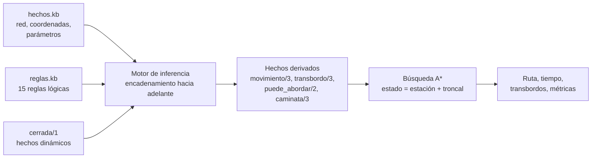

# Sistema inteligente de rutas en TransMilenio

Sistema basado en conocimiento, escrito en Python, que encuentra la **mejor ruta** entre dos estaciones del sistema de transporte masivo de Bogotá. El conocimiento sobre la red está escrito como **hechos y reglas lógicas** (sintaxis tipo Prolog/Datalog), un **motor de inferencia** con encadenamiento hacia adelante deriva qué movimientos y transbordos son posibles, y un **algoritmo de búsqueda heurística (A\*)** usa ese conocimiento para hallar la ruta de menor tiempo.

Actividad 2 · Inteligencia Artificial · Ingeniería de Software · Corporación Universitaria Iberoamericana.

## Inicio rápido

Requisitos: **Python 3.8 o superior**. No usa librerías externas.

```bash
git clone <URL-DEL-REPOSITORIO>
cd transmi-ruta-ia
python main.py                                        # modo interactivo (menú)
python main.py ruta "Portal El Dorado" "Museo del Oro"
```

En Windows puede usarse `py` en lugar de `python`. Los nombres de estación se aceptan sin tildes ni mayúsculas (`heroes`, `av jimenez`).

```text
=== Ruta: Portal El Dorado -> Museo del Oro ===
Algoritmo: A* (A estrella) | Criterio: tiempo

 1. Aborde la troncal K (Calle 26) en Portal El Dorado.
    Viaje 13 parada(s) hasta Universidades (~31.1 min).
 2. Camine de Universidades a Las Aguas por la conexión peatonal (~4 min).
 3. Aborde la troncal J (Eje Ambiental) en Las Aguas (espera ~5 min).
    Viaje 1 parada(s) hasta Museo del Oro (~1.7 min).

Resumen: ~41.8 min | 1 transbordo(s) | 14 parada(s)
Búsqueda: 17 nodos expandidos, 32 generados, frontera máx. 2, 0.27 ms
```

## Comandos

| Comando | Qué hace |
|---|---|
| `python main.py` | Menú interactivo: buscar ruta, comparar algoritmos, consultar la base, cerrar estaciones. |
| `python main.py ruta ORIGEN DESTINO` | Mejor ruta con A\*. Opciones: `-a {a_estrella,costo_uniforme,voraz,amplitud}`, `-c {tiempo,transbordos}`, `-d` (detalle de estaciones), `--cerrar EST [EST ...]`. |
| `python main.py comparar ORIGEN DESTINO` | Ejecuta las 4 estrategias de búsqueda y compara tiempo, transbordos y nodos expandidos. |
| `python main.py consultar "CONSULTA"` | Consulta lógica sobre la base, p. ej. `"transbordo(E, T1, T2)"` o `"cabecera(E, T)"`. |
| `python main.py explicar PREDICADO ARG...` | Árbol de prueba de un hecho: qué reglas y premisas lo demuestran. Ej.: `explicar transbordo Ricaurte E F`. |
| `python main.py estaciones [--troncal K]` | Lista estaciones con sus troncales, o una troncal en orden. |
| `python main.py reglas` | Muestra las reglas y las estadísticas del encadenamiento hacia adelante. |
| `python main.py escenarios` | Corre los escenarios de prueba y genera `resultados_pruebas.md`. |

Para consultas con constantes use comillas simples dentro de la consulta: `python main.py consultar "puede_abordar('Ricaurte', T)"`.

## Cómo funciona



### 1. Representación del conocimiento (lógica)

`conocimiento/hechos.kb` describe la red: troncales, estaciones consecutivas (`siguiente/3`), coordenadas aproximadas, conexiones peatonales y parámetros como la velocidad comercial. `conocimiento/reglas.kb` contiene el conocimiento sobre cómo moverse:

```prolog
tramo(A, B, T)        :- siguiente(A, B, T).
pertenece(E, T)       :- siguiente(E, _, T).
habilitada(E)         :- estacion(E), no cerrada(E).
movimiento(A, B, T)   :- tramo(A, B, T), habilitada(A), habilitada(B).
transbordo(E, T1, T2) :- pertenece(E, T1), pertenece(E, T2), distinto(T1, T2), habilitada(E).
```

Las variables van en mayúscula, `no` es negación por fallo y `distinto/2` es un predicado integrado. Ninguna estación de transbordo está escrita a mano: el sistema **infiere** que Ricaurte, Av. Jiménez, Héroes, Calle 100 y Escuela Militar son puntos de transbordo.

### 2. Motor de inferencia (sistema basado en reglas)

`sistema/logica.py` implementa, sin librerías externas, un analizador sintáctico para esa notación y un motor con **encadenamiento hacia adelante**: aplica las reglas hasta un punto fijo. Como hay negación, el motor **estratifica** el programa (evalúa `cerrada` antes que `habilitada`) y rechaza reglas inseguras o no estratificables. Cada hecho derivado guarda su justificación, lo que permite **explicar** las conclusiones:

```text
$ python main.py explicar transbordo Ricaurte E F
transbordo("Ricaurte", "E", "F")   [regla R9]
├── pertenece("Ricaurte", "E")   [regla R4]
│   └── siguiente("Paloquemao", "Ricaurte", "E")   [hecho]
├── pertenece("Ricaurte", "F")   [regla R3]
...
```

### 3. Búsqueda heurística

`sistema/busqueda.py` formula el problema como búsqueda en un espacio de estados:

- **Estado:** (estación, troncal en la que viaja). Así el costo de un transbordo queda bien representado.
- **Acciones:** abordar, viajar a la estación vecina, hacer transbordo y caminar. Las acciones válidas se obtienen **consultando la base de conocimiento** (`puede_abordar`, `movimiento`, `transbordo`, `caminata`), no están programadas en Python.
- **Costo:** minutos = distancia del tramo / velocidad comercial + tiempo de parada; 5 min por transbordo. Con `-c transbordos` cada transbordo se penaliza fuertemente para minimizar su número.
- **Heurística:** h(n) = distancia en línea recta al destino / velocidad comercial. Es **admisible** (ningún recorrido es más corto que la línea recta) y **consistente** (desigualdad triangular), por lo que A\* garantiza la ruta óptima. Las pruebas automáticas lo verifican para todas las estaciones.

Se incluyen cuatro estrategias para comparar: primero en amplitud y costo uniforme (no informadas), voraz y A\* (informadas).

```text
$ python main.py comparar "Escuela Militar" "U. Nacional"
Algoritmo              | Minutos | Transb. | Paradas | Expandidos | Generados
-----------------------+---------+---------+---------+------------+----------
A* (A estrella)        | 13.2    | 0       | 6       | 10         | 23
Costo uniforme         | 13.2    | 0       | 6       | 21         | 48
Primero el mejor voraz | 60.9    | 3       | 22      | 27         | 63
Primero en amplitud    | 13.2    | 0       | 6       | 24         | 55
```

A\* halla el óptimo expandiendo la mitad de nodos que costo uniforme; la búsqueda voraz se deja engañar porque la troncal Caracas pasa "cerca" del destino, pero no conecta con él.

## Pruebas

```bash
python -m unittest -v                 # 28 pruebas unitarias y de integración
python main.py escenarios             # 10 escenarios de uso -> resultados_pruebas.md
```

Las pruebas cubren el analizador, la inferencia (recursión, negación, estratificación, reglas inseguras), la optimalidad de A\* frente a costo uniforme, la admisibilidad de la heurística, estaciones cerradas, ausencia de ruta y nombres sin tildes.

## Cómo extender la base de conocimiento

Para agregar una troncal (por ejemplo Suba, código C) basta editar `conocimiento/hechos.kb`:

```prolog
troncal("C", "Suba").
siguiente("Portal Suba", "La Campiña", "C").
% ... resto de tramos
coordenadas("Portal Suba", 4.7460, -74.0940).
```

No hay que tocar el código: las reglas infieren automáticamente los nuevos transbordos. Si falta la coordenada de alguna estación, el sistema lo informa al iniciar.

## Limitaciones del modelo

- Es una red **simplificada** (7 troncales, 85 estaciones). El orden de estaciones se basó en información pública de TransMilenio, pero las coordenadas son **aproximadas** y deben validarse contra el mapa oficial o el portal de datos abiertos de TransMilenio antes de cualquier uso real.
- Modela troncales, no servicios (B12, D21…): no distingue rutas expresas de corrientes ni frecuencias, y un cambio de troncal siempre cuenta como transbordo.
- Los tiempos son estimaciones por distancia; no consideran congestión ni hora pico.
- Una estación cerrada se trata como fuera de servicio y sin paso.

## Estructura

```text
transmi-ruta-ia/
├── main.py                  # CLI y modo interactivo
├── conocimiento/
│   ├── hechos.kb            # base de hechos (red de TransMilenio)
│   └── reglas.kb            # base de reglas
├── sistema/
│   ├── logica.py            # parser + motor de inferencia + explicaciones
│   ├── red.py               # carga la base, costos, heurística, nombres
│   ├── busqueda.py          # problema de búsqueda y algoritmos
│   └── presentacion.py      # formato de salida
└── tests/
    ├── test_logica.py
    └── test_busqueda.py
```
## Referencias

- Benítez, R. (2014). *Inteligencia artificial avanzada*. Barcelona: Editorial UOC. Caps. 2, 3 y 9.
- Russell, S. y Norvig, P. (2021). *Artificial Intelligence: A Modern Approach* (4.ª ed.). Pearson. Caps. 3, 7 y 9.
- TransMilenio S.A. Información de troncales y estaciones: https://www.transmilenio.gov.co
